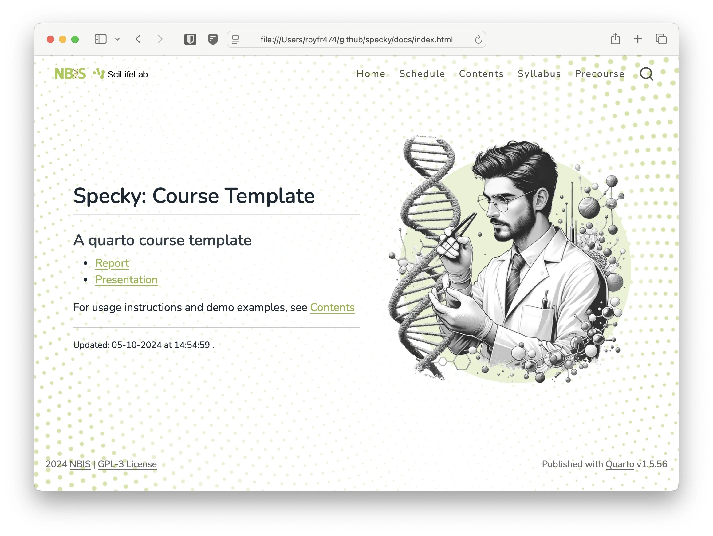
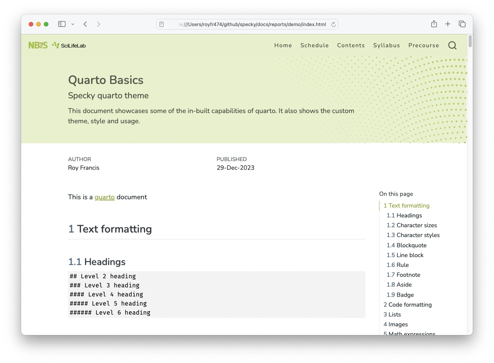

# specky

[](https://github.com/royfrancis/specky/actions?workflow=deploy)    [](https://lifecycle.r-lib.org/articles/stages.html#experimental)

Quarto website template for courses






For a demo site and usage, see [here](https://royfrancis.github.io/specky).

## Usage

- Required quarto 1.4.0 or higher
- To download and use a starter template, run in the terminal

:exclamation: Demo files are not downloaded

```
quarto use template royfrancis/specky
```

- Render all html files into `docs` directory to make sure everything works as expected

```
quarto render
```

- Use `##` as the highest level heading.
- Limited documentation is available on the [demo site](https://royfrancis.github.io/specky/home_contents.html) for customization

## Acknowledgements

- Built using [Quarto](https://quarto.org/)
- Uses the [fontawesome extension](https://github.com/quarto-ext/fontawesome) for icons
- Uses the [reveal-logo extension](https://github.com/royfrancis/reveal-logo) for logos in presentation 

---

2024 • Roy Francis
