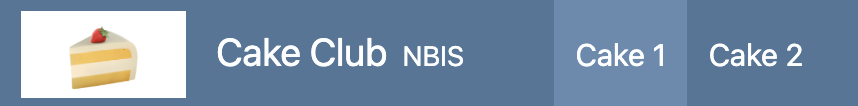
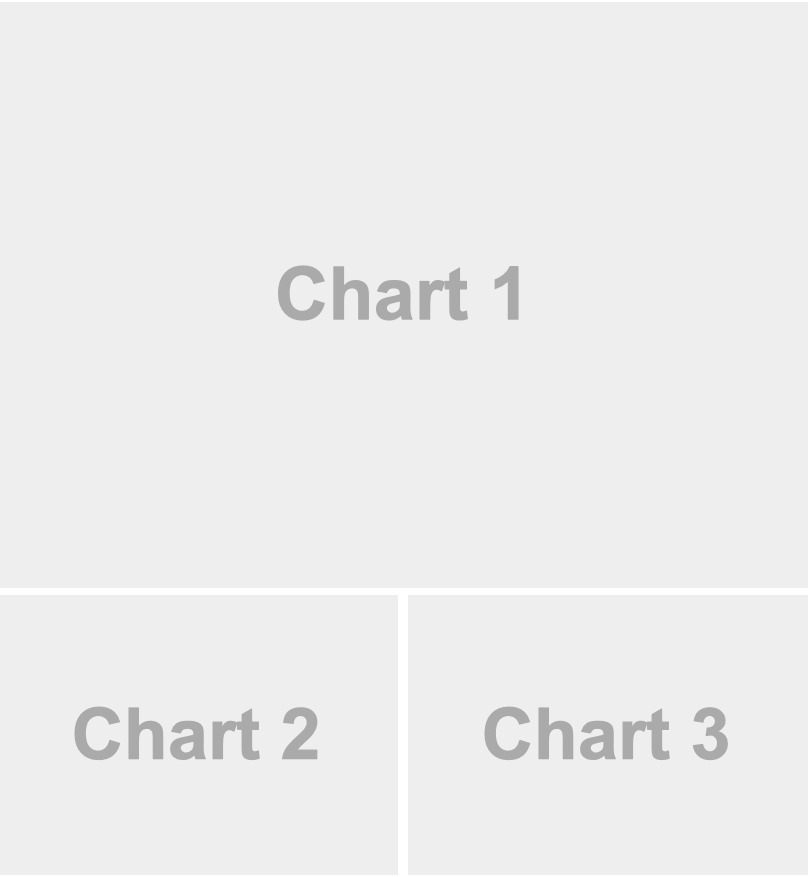
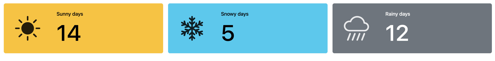
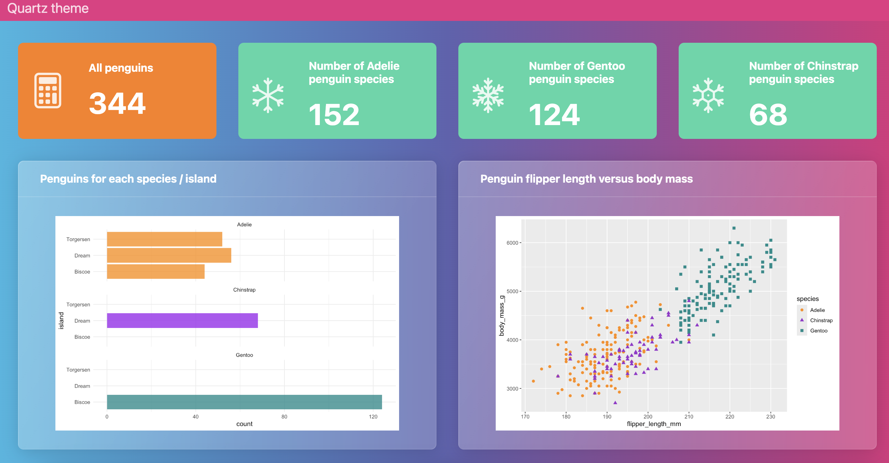
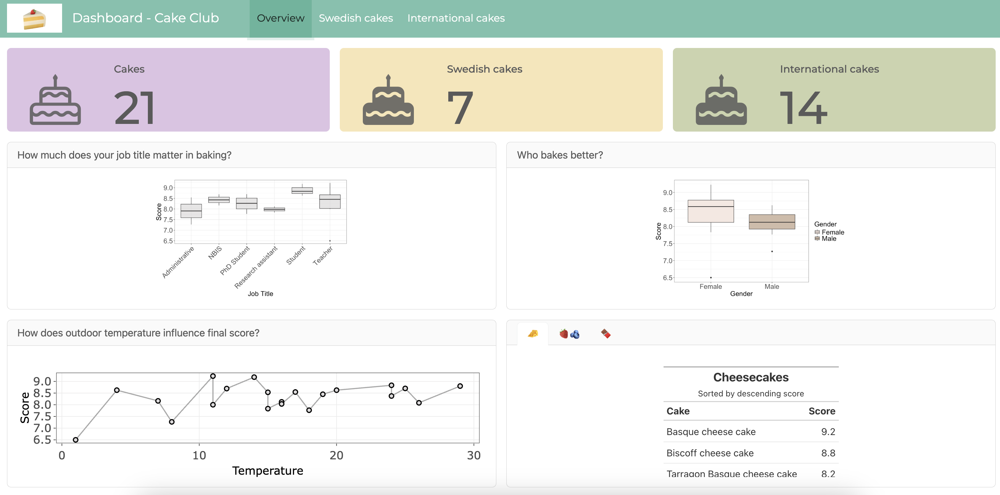
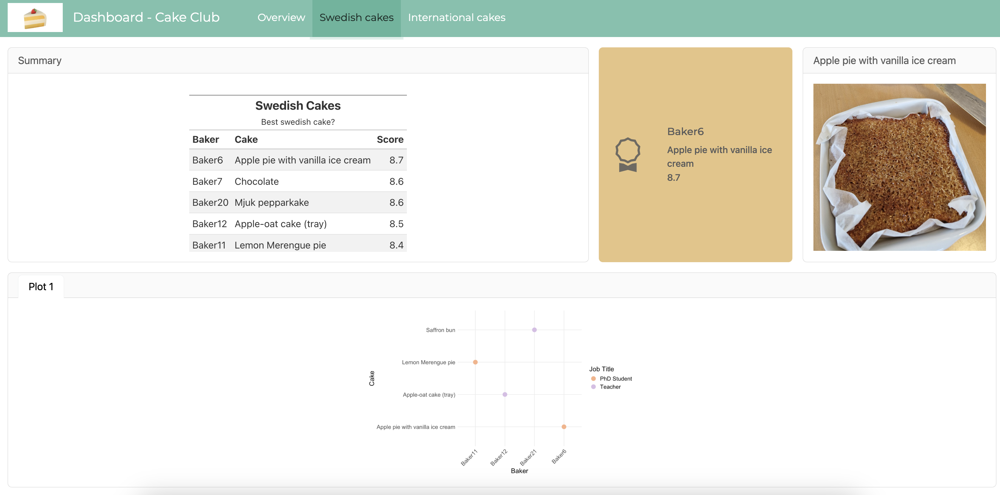
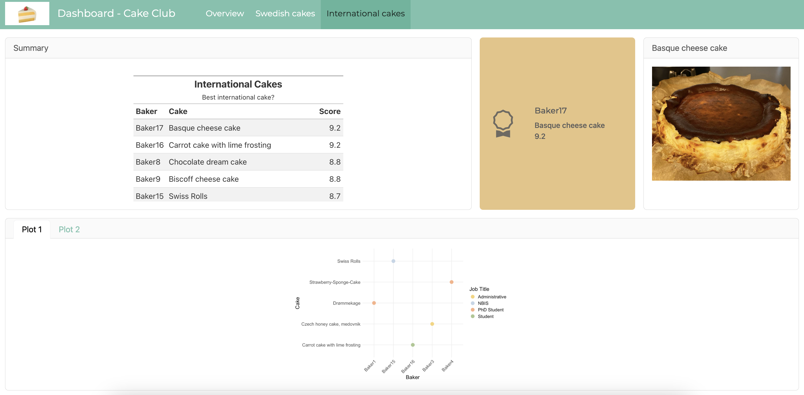

::: {.callout-note}
These are exercises to get you started with Quarto Dashboards. Refer to the official [Quarto Dashboards](https://quarto.org/docs/dashboards/) documentation for help.

By the end of this exercise, you will be able to:

- Create a basic Quarto dashboard.
- Become familiar with different components of a dashboard.
- Customize dashboard layout and appearance.
- Add dynamic components to your dashboard.
:::

::: {.callout-warning title="Dataset"}
For this exercise, we will use the [cake data](https://github.com/ImmunTech/CakeClub) (year 2024) provided by the Immunotechnology Cake Club in Lund. The GitHub repository also includes pictures of all the cakes.
:::

# Introduction
Dashboards are a powerful way to communicate data and insights in a visually appealing manner. With Quarto dashboards we can create elegant and production-ready dashboards using a variety of components such as **static graphics** (ggplot2, Matplotlib, Seaborn, etc.), **dynamic widgets** (plotly, leaflet, htmlwidgets, etc.), charts, tables, value boxes, and text annotations that are arranged in a structured layout.

The dashboard building process begins with a basic Quarto document. This document is then transformed into a dashboard by changing the document format to `dashboard`. 

# Dashboard structure
- Dashboards are composed of **cards**.
- Cards are arranged into **rows** and **columns**.
- **Pages, tabsets**, and **sidebars** allow for more advanced layouts.

## Dashboard layout

**Navigation**

All dashboards include a top-level navigation bar that provide a title and (optionally) a logo and author. Dashboards with multiple pages also contain a link to each page on the navigation bar. The `title` and `author` are specified as they are in normal Quarto documents. You can also include a `logo`. 


```{.yaml}
---
title: "Cake Club"
author: "NBIS"
format: 
  dashboard: 
    logo: ./Downloads/cake-emoji.png
---
```



**Layout - rows and columns**

Rows and columns are defined using markdown headings (with optional attributes to control height, width, etc.).

- Every Level 2 header (##) introduces a new row.

- Every code chunk introduces a new column.

This example shows simple layout with two rows, where the second row is split into two columns. Moreover, Level 2 markdown headings (e.g. `## Row {height=70%}`) define the contents of rows as well as their relative height. The `{}` code cells in turn automatically create cards that are laid out in columns within the row.

::: {.chart-example .grid}
::: g-col-5
````
---
title: "Cake club"
format: dashboard
---
    
## Row {height=70%}

```{r}
```

## Row {height=30%}

```{r}
```

```{r}
```
````
:::

::: g-col-7

:::
:::

::: {.callout-note title="Orientation"}
The default orientation setting is **by rows**. You can set the orientiation to be **by column** in the YAML specifying the `orientation: columns`. If that is the case, then the Level 2 header would be a column and each code chunk a row in the column.

Quarto automatically divides the area into equally divided charts.
:::

**Pages**

To introduce multiple pages, use Level 1 headings above the Level 2 headings used to define rows and columns. The text of the Level 1 headings will be used to link to the pages in the navigation bar. 

For example, here is a dashboard that splits content across two pages. 

::: {.chart-example .grid}
::: g-col-5
````
---
title: "Cake club"
format: dashboard
---
    
# Cake 1 

```{{r}}
```

# Cake 2

## Column

```{{r}}
```

```{{r}}
```

## Column 

```{{r}}
```
````
:::

::: g-col-7

:::
:::

**Tabsets**

Use tabsets to include multiple views of data or to include content of secondary importance without having it crowd the main display. Tabsets are created by adding the `.tabset` class to a row or column. 

For example, this layout displays the bottom row as a set of two tabs.

::: {.chart-example .grid}
::: g-col-5
````
---
title: "Cake club"
format: dashboard
---
    
## Row

```{{r}}
```

## Row {.tabset}

```{{r}}
#| title: Chart 2
```

```{{r}}
#| title: Chart 3
```
````
:::

::: g-col-7

:::
:::

**Cards**

Cards are the fundamental unit of display within dashboards. They are created automatically for each code chunk or explicitly using the `card` option.

Here each of the r cells become card. 

```` {.yaml}
## Column {width=40%}

```{{r}}
```

```{{r}}
```
````

Here `.card` option is used.

```` {.yaml}
## Column {width=40%}

```{{r}}
```

::: {.card}
This text will be displayed within a card
:::

```{{r}}
```
````

To provide a title for a markdown card use the `title` attribute. 

For example: 
```` {.yaml}
::: {.card title="My Title"}
This text will be displayed within a card
:::
````

## Other features

**Value boxes**

Value boxes are a great way to prominently display simple values within a dashboard. For example, here is a dashboard row with three value boxes. 



````
## Row

```{{r}}
#| content: valuebox
#| title: "Sunny days"
list(
  icon = "brightness-high-fill",
  color = "warning",
  value = 14
)
```

```{{r}}
#| content: valuebox
#| title: "Snowy days"
list(
  icon = "snow2",
  color = "info",
  value = 5
)
```

```{{r}}
#| content: valuebox
#| title: "Rainy days"
list(
  icon = "cloud-rain-heavy",
  color = "secondary",
  value = 12
)
```
````

The `icon` used in value boxes can be any of the 2,000 available [bootstrap icons](https://icons.getbootstrap.com/).

The `color` can be any [CSS color value](https://www.w3schools.com/cssref/css_colors_legal.php), however there are some color aliases that are tuned specifically for dashboards that you might consider using by default:

| Color Alias | Default Theme Color(s) |
|--------------|---------------|
| `primary`   | Blue |
| `secondary` | Gray |
| `success`   | Green |
| `info`      | Bright Blue |
| `warning`   | Yellow/Orange |
| `danger`    | Red |
| `light`     | Light Gray |
| `dark`      | Black |

The `value` can be a variable created previously within the document, or randomly assigned value as here.

**Sidebars**

Sidebars are a great place to group inputs for dashboards. By adding a new Level 2 headline with a `.sidebar` class, you can easily add a collapsible sidebar.

::: {.chart-example .grid}
::: g-col-5
````
---
title: "Cake club"
format: dashboard
---
    
# Page 1

## {.sidebar}

```{{r}}
```

## Column 

```{{r}}
```

```{{r}}
```
````
:::

::: g-col-7

:::
:::

**Dashboard theming**

Quarto Dashboards use same Bootstrap 5 based theming system as regular HTML documents (so themes you have built for HTML websites can also be used with dashboards). Use any of the 25 [themes](https://bootswatch.com/) from the Bootswatch project via the `theme` option.

```{.yaml}
title: "Quartz theme"
format: 
  dashboard:
    theme: quartz
```


You can provide a light and dark theme and Quarto will automatically place a light or dark toggle on the navbar.

```{.yaml}
format: 
  dashboard:
    theme:
      light: flatly
      dark: darkly
```

You can create your own custom theme and apply it to your dashboard or you can modify existing Bootswatch themes, by following the instructions in the [Quarto theming documentation](https://quarto.org/docs/dashboards/theming.html).

# Dashboard deployment

There are several options to [deploy](https://quarto.org/docs/dashboards/deployment.html) your Quarto dashboard. If you are deploying a static dashboard (i.e. not using Shiny for interactivity), you can simply publish it to any web server. Among them the most common options include [Posit Connect Could](https://quarto.org/docs/publishing/posit-connect-cloud.html) and [GitHub Pages](https://quarto.org/docs/publishing/github-pages.html).

Dashboards that use Shiny for interactivity require a server for deployment. Deployment options include [shinyapps.io](https://www.shinyapps.io/), [Shiny Server](https://posit.co/download/shiny-server) and [Posit Connect](https://posit.co/products/enterprise/connect). 

# Exercise

Your task is to build your own dashboard using the provided `cake data`. Start by creating a simple dashboard with one row and one column. Use the dashboard example below as a foundation to understand the structure. Once comfortable, expand your dashboard by adding pages, tabsets, or additional rows and columns for a more advanced layout. Explore different themes. To add logo or other images check the [GitHub repository](https://github.com/ImmunTech/CakeClub/tree/main/assets). Optionally, enhance your dashboard with dynamic components like `plotly`. 

{.lightbox}

{.lightbox}

{.lightbox}