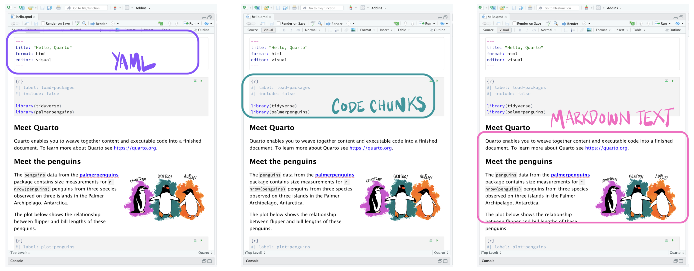

## What do you currently use? 
::: {.fragment}
What tools, softwares do you use to perform analysis? What do you use for calculations and visualizations?

- Excel?
- R? 
- Python?
:::

::: {.fragment}
How do you write reports, journal articles, presentations?

- Word?
- PowerPoint?
- LaTeX?
- R Markdown?
:::

## What is [Quarto](https://quarto.org/)?

Quarto is an **open-source scientific and technical publishing system**.
<br>

::: {.incremental}
- Quarto allows you to combine text, images, code, plots, and tables in a fully-reproducible document. 
- It supports multiple programming languages (R, Python, Julia, etc.). 
- It works with various output formats (HTML, PDF, presentations, websites, etc.) 
- It is compatible with multiple editors (RStudio, VS Code, Jupyter Lab, etc.).
:::

<br>

::: {.fragment}
{height="80%" width="80%" fig-align="center"}
:::

## Why use Quarto?
- More journals require code submission to promote reproducibility and transparency. 
- Copying and pasting is tedious and a great source of accidental errors.
- If you fix an error in code or data, the results and figures in the paper update automatically.
- Easy collaboration and sharing. 
- Open source so anyone can use it.

## Installation

- Install the latest [Quarto CLI](https://quarto.org/docs/get-started/)
- Choose preferred tool: [Positron](https://quarto.org/docs/get-started/hello/positron.html), [RStudio](https://quarto.org/docs/get-started/hello/rstudio.html), [Visual Studio Code](https://quarto.org/docs/get-started/hello/vscode.html), [Jupyter Lab](https://quarto.org/docs/get-started/hello/jupyter.html)

<br>

- If using [RStudio](https://posit.co/download/rstudio-desktop/), you need a version v2022.07.1 or newer
- R package **quarto** is a wrapper around the Quarto CLI, it provides an R interface to common Quarto operations for users who prefer to work in the R console rather than a terminal
- [Visual Studio Code](https://code.visualstudio.com/) along with Quarto VS Code extension is a great option

## Quarto document anatomy{.smaller}
Quarto file – a plain text file that has the extension **.qmd**



## Rendering Quarto document
::: {.fragment}
- **Preview** (while writing to see changes instantly)
    - From R console using the quarto R package: `quarto::quarto_preview("report.qmd")`
    - From terminal: `quarto preview report.qmd`
:::

::: {.fragment}
- **Render** (to create the final version of the document)
    - Using the **Render** button in RStudio
    - From R console using the quarto R package: `quarto::quarto_render("report.qmd")`
    - From terminal: `quarto render report.qmd`
:::

## How rendering works?

<br>
<br>


::: {.notes}
When you render a Quarto document, first knitr executes all of the code chunks and creates a new markdown (.md) document, which includes the code and its output. The markdown file generated is then processed by pandoc, which creates the finished format. The Render button encapsulates these actions and executes them in the right order for you.
:::

## YAML metadata
:::: {.columns}
::: {.column width="50%"}
````
---
title: "Intro to Quarto"
format: html
---
````
:::

::: {.column}
- Bracketed by `---`
- Defines document-wide options
- Specifies the output format
- Can include [several parameters](https://quarto.org/docs/reference/)
:::
::::

## Document content (Markdown text)
- Images, tables, text, videos, equations, etc.
- Freely add and format text using Markdown syntax

::: {.fragment}
````
# Meet the penguins
The `palmerpenguins` data contains size measurements for three penguin species 
observed on three islands in the Palmer Archipelago, Antarctica.


The three species of penguins have quite distinct 
distributions of physical dimensions (@fig-penguins).

## Bill dimensions
````
:::

## Code chunks{.smaller}
::: {style="font-size: 1.6rem"}
- Code blocks are the main way of including executable R code in a document.
- They are defined by three backticks followed by the language name, and closed by three backticks.
- Specify global and/or local [chunk options](https://quarto.org/docs/computations/execution-options.html) (_e.g._ figure dimensions)
- Also works with other languages (_e.g._ Python)
:::

::: {.fragment}
````
## Bill dimensions
```{{r}}
#| label: fig-penguins
#| fig-cap: "Bill dimensions of penguins across three species."
#| fig-width: 10
#| fig-height: 5

penguins %>%
  ggplot(aes(x = bill_length_mm, y = bill_depth_mm)) +
  geom_point(aes(color = species, 
                shape = species),
                size = 2) + 
  geom_smooth(method = "lm", se = FALSE, aes(color = species)) +
  scale_color_manual(values = c("darkorange","darkorchid","cyan4")) + 
  labs(color = "Species", shape = "Species") + 
  xlab("Bill length (mm)") + ylab("Bill depth (mm)") + 
  theme_bw()
```
````
:::

## Output formats
- Reports and general documents: HTML, PDF, MS Word
- Presentations: Revealjs, PowerPoint, Beamer
- Interactive documents: Observable, R Shiny
- Books
- Websites

## Moving between output formats is straightforward

::: columns
::: {.column width="33%"}
::: fragment
**Document HTML**

::: {.code-file .sourceCode .cell-code}
 lesson-1.qmd
:::

``` yaml
title: "Lesson 1"
format: html
```
:::
:::

::: {.column width="33%"}
::: fragment
**Document PDF**

::: {.code-file .sourceCode .cell-code}
 lesson-1.qmd
:::

``` yaml
title: "Lesson 1"
format: pdf
```
:::
:::

::: {.column width="33%"}
::: fragment
**Presentation**

::: {.code-file .sourceCode .cell-code}
 lesson-1.qmd
:::

``` yaml
title: "Lesson 1"
format: revealjs
```
:::
:::

::: {.column width="45%"}
::: fragment
**Website**

::: {.code-file .sourceCode .cell-code}
 _quarto.yml
:::

``` yaml
project:
  type: website

website: 
  navbar: 
    left:
      - lesson-1.qmd
```
:::
:::
:::

::: {.column width="45%"}
::: fragment
**Book**

::: {.code-file .sourceCode .cell-code}
 _quarto.yml
:::

``` yaml
project:
  type: book

website: 
  navbar: 
    left:
      - lesson-1.qmd
```
:::
:::

## Sources
- [R for Data Science book](https://r4ds.hadley.nz/quarto.html)
- [Hello Quarto](https://mine.quarto.pub/hello-quarto/#/hello-quarto-title)
- [Guides](https://quarto.org/docs/guide/)
- [RaukR 2024](https://nbisweden.github.io/raukr-2024/slides/quarto/#/title-slide) (Quarto by Roy Francis)
- [Getting started with Quarto](https://rstudio-conf-2022.github.io/get-started-quarto/)
- [Quarto cheatsheet](https://rstudio.github.io/cheatsheets/quarto.pdf)

## {background-image="../../assets/images/precourse/data_viz_adv_2.jpeg"}

::: {.center-xy}
### Thank you. Questions? {style="text-align: center;"}
:::
