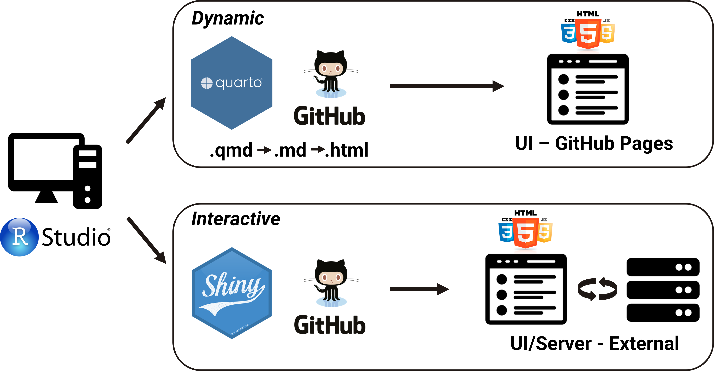

## Static vs. dynamic plotting 

:::: {.columns}
::: {.column width="50%"}
**Static plotting**
```{r}
#| echo: false
library(ggplot2)
library(palmerpenguins)

ggplot(data = penguins, aes(x = flipper_length_mm, y = body_mass_g)) +
  geom_point(aes(color = species),
             size = 3) +
scale_color_manual(values = c("darkorange","darkorchid","cyan4")) + 
theme_bw() + 
labs(color="Species") +
theme(axis.text = element_text(size = 16), 
            axis.title = element_text(size = 16), 
            legend.text = element_text(size = 16), 
            legend.title = element_text(size = 16))
```

::: {.notes}
Static plots display fixed relationships between two or more variables. Once created, these plots cannot be modified or interacted with by the user; all elements remain constant.
:::
:::

::: {.column width="50%"}
**Dynamic plotting**
```{r}
#| echo: false
library(palmerpenguins)
library(plotly)

penguins %>%
    plot_ly(x = ~flipper_length_mm, y = ~body_mass_g, 
                    color = ~species, 
                    colors = c("darkorange", "darkorchid", "cyan4"),
                    width = 550, height = 400) %>%
    add_markers() %>%
    layout(legend = list(title = list(text = "Species")))
```

::: {.notes}
Dynamic plotting, also known as interactive plotting, allows users to interact with the visualization. Users can modify certain aspects of the plot, explore the data more deeply, and gain better insight into the underlying patterns.
:::
:::
::::

## Dynamic and Interactive applications


::: {.notes}
Dynamic applications may resemble interactive Shiny dashboards in terms of appearance and user experience, but they differ significantly in structure. These applications are standalone and do not rely on a server component. Instead, all interactive features are pre-built within the application itself, and the final product is generated as an HTML file, ready to be hosted on a web platform. Tools like Quarto (and its predecessor, RMarkdown) are often used to create such dynamic applications.

Interactive applications consist of both, a user interface (UI) and server, enabling users to send requests to the server through the UI. This setup allows the application’s components to be reactive, meaning the content displayed on the UI dynamically responds to the user’s inputs, creating a fully interactive experience. To build these applications, you need R scripts that define the UI and server components, either as separate or combined scripts.

In this workshop, we will cover both dynamic and interactive applications. First, we will explore how to create dynamic applications using Quarto, especially how to incorporate dynamic components directly into a Quarto HTML document and consequently incorporate interactivity without learning JavaScript or requiring a Shiny Server to view your document. 

Then, we will dive into building interactive applications with Shiny, focusing on the structure and components required for their development. By the end of today and tomorrow, you will have a clear understanding of the differences between these two approaches and the tools needed to implement them effectively.
:::

## Quarto using `htmlwidgets`

::: {.fragment}
- `htmlwidgets` work just like R plots except they produce dynamic/interactive web visualizations
- `htmlwidgets` support adding dynamic, interactive elements directly into Quarto documents
- Do not require any knowledge of JavaScript, nor use of a Shiny Server
:::


::: {.fragment}
- There are [many widgets](https://gallery.htmlwidgets.org/) to choose from, most known are: 
    - [plotly](https://plotly.com/r/)
    - [ggiraph](https://davidgohel.github.io/ggiraph/)
    - [dygraphs](https://rstudio.github.io/dygraphs/)
    - [leaflet](https://rstudio.github.io/leaflet/)
    - [DT](https://rstudio.github.io/DT/)
:::

## [plotly](https://plotly.com/r/)
:::: {.columns}
::: {.column width="55%"}
````{.yaml style="overflow-y: hidden" code-line-numbers="|6-8"}
```{{r}}
library(plotly)
library(palmerpenguins)

penguins %>%
    plot_ly(x = ~flipper_length_mm, y = ~body_mass_g, 
    color = ~sex, width = 550, height = 400) %>%
    add_markers()
```
````

`add_markers():` This adds markers (points) to the plot. Each row in the dataset will be represented as a marker at the corresponding (x, y) coordinates.
:::

::: {.column width="45%"}
```{r}
#| echo: false
library(plotly)
library(palmerpenguins)
penguins %>%
    plot_ly(x = ~flipper_length_mm, y = ~body_mass_g, 
    color = ~sex, width = 550, height = 400) %>%
    add_markers()
```
:::
::::

::: {.notes}
If we want to plot multiple plots in a single view, we can use the `subplot()` function from the `plotly` package. This function allows us to arrange multiple plots in a grid layout, making it easy to compare different visualizations side by side.
:::

## [ggiraph](https://davidgohel.github.io/ggiraph/) {.smaller}
:::: {.columns}
::: {.column}
::: {style="font-size: 1.6rem"}
- Compared to `plotly` it offers more control and customization options
- Allows adding tooltips, hover effects, etc.
:::

````{.yaml style="overflow-y: hidden" code-line-numbers="|16,17,27-31"}
```{{r}}
#| fig-width: 12
#| fig-height: 8
library(ggiraph)
library(ggplot2)

tb_data <- read.csv("./data/bcg-immunization-coverage-for-tb-among-1-year-olds.csv", sep = ",", header = T)

tb_data_filt <- tb_data[grepl("^P", tb_data$Entity), ]

mean_tb_data <- tb_data_filt %>%
  group_by(Entity, Year) %>%
  summarise(mean_share = mean(Share_of_newborns)) 

p1 <- ggplot(mean_tb_data, aes(x = Year, y = mean_share, col = Entity, data_id = Entity)) +
    geom_line_interactive(aes(tooltip = Entity), linewidth = 2.5) +
    geom_point_interactive(size = 4) +
    labs(x = "Year", y = "Share of Newborns (%)") + 
    scale_color_manual(values =c ("#7F3C8D","#11A579","#3969AC","#F2B701","#E73F74","#80BA5A","#E68310","#008695","#CF1C90")) + 
    scale_fill_manual(values =c ("#7F3C8D","#11A579","#3969AC","#F2B701","#E73F74","#80BA5A","#E68310","#008695","#CF1C90")) + 
    theme_minimal() + 
    theme(axis.text = element_text(size = 20),
            axis.title = element_text(size = 20),
            legend.text = element_text(size = 20), 
            legend.position = "none")

girafe(ggobj = p1,
       options = list(
    opts_hover(css = ""), ## CSS code of line we're hovering over
    opts_hover_inv(css = "opacity:0.1;") ## CSS code of all other lines
  ))
```
````
:::
::: {.column}
```{r}
#| echo: false
#| fig-width: 12
#| fig-height: 8
library(ggiraph)
library(ggplot2)

tb_data <- read.csv("./data/bcg-immunization-coverage-for-tb-among-1-year-olds.csv", sep = ",", header = T)

tb_data_filt <- tb_data[grepl("^P", tb_data$Entity), ]

mean_tb_data <- tb_data_filt %>%
  group_by(Entity, Year) %>%
  summarise(mean_share = mean(Share_of_newborns)) 

p1 <- ggplot(mean_tb_data, aes(x = Year, y = mean_share, col = Entity, data_id = Entity)) +
    geom_line_interactive(aes(tooltip = Entity), linewidth = 2.5) +
    geom_point_interactive(size = 4) +
    labs(x = "Year", y = "Share of Newborns (%)") + 
    scale_color_manual(values =c ("#7F3C8D","#11A579","#3969AC","#F2B701","#E73F74","#80BA5A","#E68310","#008695","#CF1C90")) + 
    scale_fill_manual(values =c ("#7F3C8D","#11A579","#3969AC","#F2B701","#E73F74","#80BA5A","#E68310","#008695","#CF1C90")) + 
    theme_minimal() + 
    theme(axis.text = element_text(size = 20),
            axis.title = element_text(size = 20),
            legend.text = element_text(size = 20), 
            legend.position = "none")

girafe(ggobj = p1,
       options = list(
    opts_hover(css = ""), ## CSS code of line we're hovering over
    opts_hover_inv(css = "opacity:0.1;") ## CSS code of all other lines
  ))
```
:::
::::

## [ggiraph](https://davidgohel.github.io/ggiraph/) {.smaller}
:::: {.columns}
::: {.column}
````{.yaml style="overflow-y: hidden" code-line-numbers="|9,18-22"}
```{{r}}
#| fig-width: 12
#| fig-height: 8
library(ggiraph)
library(ggplot2)
library(patchwork)

p2 <- ggplot(mean_tb_data, aes(x = Entity, y = mean_share, col = Entity, data_id = Entity)) +
    geom_boxplot_interactive(aes(fill = Entity)) +
    labs(x = "Entity", y = "Share of Newborns (%)") + 
    coord_flip() +
    scale_color_manual(values =c ("#7F3C8D","#11A579","#3969AC","#F2B701","#E73F74","#80BA5A","#E68310","#008695","#CF1C90")) + 
    scale_fill_manual(values =c ("#7F3C8D","#11A579","#3969AC","#F2B701","#E73F74","#80BA5A","#E68310","#008695","#CF1C90")) + 
    theme_minimal() + 
    theme(axis.text = element_text(size = 20),
            axis.title = element_text(size = 20),
            legend.position = "none")

girafe(ggobj = p1 + p2,
       options = list(
    opts_hover(css = ""), ## CSS code of line we're hovering over
    opts_hover_inv(css = "opacity:0.1;") ## CSS code of all other lines
  ))
```
````
:::
::: {.column}
```{r}
#| echo: false
#| fig-width: 12
#| fig-height: 8
library(ggiraph)
library(ggplot2)
library(patchwork)

p2 <- ggplot(mean_tb_data, aes(x = Entity, y = mean_share, col = Entity, data_id = Entity)) +
    geom_boxplot_interactive(aes(fill = Entity)) +
    labs(x = "Entity", y = "Share of Newborns (%)") + 
    coord_flip() +
    scale_color_manual(values =c ("#7F3C8D","#11A579","#3969AC","#F2B701","#E73F74","#80BA5A","#E68310","#008695","#CF1C90")) + 
    scale_fill_manual(values =c ("#7F3C8D","#11A579","#3969AC","#F2B701","#E73F74","#80BA5A","#E68310","#008695","#CF1C90")) + 
    theme_minimal() + 
    theme(axis.text = element_text(size = 20),
            axis.title = element_text(size = 20),
            legend.position = "none")

girafe(ggobj = p1 + p2,
       options = list(
    opts_hover(css = ""), ## CSS code of line we're hovering over
    opts_hover_inv(css = "opacity:0.1;") ## CSS code of all other lines
  ))
```
:::
::::

:::{.notes}
Data used: https://ourworldindata.org/grapher/bcg-immunization-coverage-for-tb-among-1-year-olds?time=2020
library(patchwork) is used to combine multiple ggplots into a single layout.
ggiraph also works with cowplot to combine multiple plots.
:::

## [leaflet](https://rstudio.github.io/leaflet/) {.smaller}
::: {style="font-size: 1.6rem"}
- For creating dynamic maps that support panning and zooming along with various annotations like markers, basemaps, and pop-ups
- Let's check where **NBIS has drop-ins on Wednesdays at 10.30 in Lund**
:::

:::::{.fragment}
::::{.columns}
:::{.column}
````{.yaml style="overflow-y: hidden" code-line-numbers="|7-15"}
```{{r}}
library(leaflet)

df <- data.frame(lng = c(13.20279, 13.20869, 13.21894),
                 lat = c(55.71118, 55.71414, 55.71092))

icons_list <- awesomeIcons(icon = 'briefcase',
  iconColor = 'white',
  library = 'ion', 
  markerColor = "cadetblue")

leaflet(width = "100%") %>%
  addTiles() %>%
  setView(lng = 13.21014,lat = 55.71208, zoom = 12) %>%
  addAwesomeMarkers(data = df, icon = icons_list, popup = c("Forum Medicum Café", "Café Le Mani", "MV Inspira"))
```
````
:::

::: {.column}
```{r}
#| echo: false
library(leaflet)

df <- data.frame(lng = c(13.20279, 13.20869, 13.21894),
                 lat = c(55.71118, 55.71414, 55.71092))

icons_list <- awesomeIcons(icon = 'briefcase',
  iconColor = 'white',
  library = 'ion', 
  markerColor = "cadetblue")

leaflet(width = "100%") %>%
  addTiles() %>%
  setView(lng = 13.21014,lat = 55.71208, zoom = 12) %>%
  addAwesomeMarkers(data = df, icon = icons_list, popup = c("Forum Medicum Café", "Café Le Mani", "MV Inspira"))
```
:::
::::
:::::

## [dygraphs](https://rstudio.github.io/dygraphs/) {.smaller}
::: {style="font-size: 1.6rem"}
- For creating dynamic time series plots
:::

::::{.columns}
::: {.column width="40%"}
````{.yaml style="overflow-y: hidden" code-line-numbers="|16-20"}
```{{r}}
library(dplyr)
library(tidyverse)
library(dygraphs)

tb_data <- read.csv("./data/bcg-immunization-coverage-for-tb-among-1-year-olds.csv", sep = ",", header = T)

tb_data_filt <- tb_data[grepl("^F", tb_data$Entity), ]

tb_data_select <- tb_data_filt %>% select(Entity, Year, Share_of_newborns)
tb_data_dygraph <- tb_data_select %>%
    pivot_wider(names_from = Entity, values_from = Share_of_newborns)

tb_data_dygraph$Year <- as.numeric(tb_data_dygraph$Year)

dygraph(tb_data_dygraph, main = "BCG Immunization Coverage for TB among 1-year-olds") %>% 
    dySeries("Fiji", color = "#332288", strokeWidth = 2) %>% 
    dySeries("Finland", color = "#AA4499", strokeWidth = 2) %>% 
    dySeries("France", color = "#44AA99", strokeWidth = 2) %>% 
    dyRangeSelector()
```
````
- Data for `dygraph` needs to be in a [specific format](https://r-graph-gallery.com/316-possible-inputs-for-the-dygraphs-library.html), first column should be the time variable
:::

::: {.column width="60%"}
```{r}
#| echo: false
library(dplyr)
library(tidyverse)
library(dygraphs)

tb_data <- read.csv("./data/bcg-immunization-coverage-for-tb-among-1-year-olds.csv", sep = ",", header = T)

tb_data_filt <- tb_data[grepl("^F", tb_data$Entity), ]

tb_data_select <- tb_data_filt %>% select(Entity, Year, Share_of_newborns)
tb_data_dygraph <- tb_data_select %>%
    pivot_wider(names_from = Entity, values_from = Share_of_newborns)

tb_data_dygraph$Year <- as.numeric(tb_data_dygraph$Year)

dygraph(tb_data_dygraph, main = "BCG Immunization Coverage for TB among 1-year-olds") %>% 
    dySeries("Fiji", color = "#332288", strokeWidth = 2) %>% 
    dySeries("Finland", color = "#AA4499", strokeWidth = 2) %>% 
    dySeries("France", color = "#44AA99", strokeWidth = 2) %>% 
    dyRangeSelector()
```
:::
::::

## [DT](https://www.htmlwidgets.org/showcase_datatables.html) {.smaller}
:::: {.columns}
::: {style="font-size: 1.6rem"}
- Offers the ability to sort and filter data
:::

::: {.column width="30%"}
````{.yaml style="overflow-y: hidden" code-line-numbers="|6"}
```{{r}}
library(DT)

tb_data <- read.csv("./data/bcg-immunization-coverage-for-tb-among-1-year-olds.csv", sep = ",", header = T)

datatable(tb_data, filter = "top", class = 'cell-border stripe')
```
````
:::

::: {.column width="70%"}
```{r}
#| echo: false
library(DT)

tb_data <- read.csv("./data/bcg-immunization-coverage-for-tb-among-1-year-olds.csv", sep = ",", header = T)

datatable(tb_data, filter = "top", class = 'cell-border stripe')
```
:::
::::

## [reactable](https://glin.github.io/reactable/) {.smaller}
:::: {.columns}
::: {style="font-size: 1.6rem"}
- Offers the ability to sort and filter data
- Slightly more challenging to work with it compared to `DT`, but offers more customization options
- `reactablefmtr` package provides additional formatting options for `reactable` tables
:::

::: {.column width="30%"}
````{.yaml style="overflow-y: hidden" code-line-numbers="|6"}
```{{r}}
library(reactable)

tb_data <- read.csv("./data/bcg-immunization-coverage-for-tb-among-1-year-olds.csv", sep = ",", header = T)

reactable(tb_data, filterable = TRUE, minRows = 10)
```
````
:::

::: {.column width="70%"}
```{r}
#| echo: false
library(reactable)

tb_data <- read.csv("./data/bcg-immunization-coverage-for-tb-among-1-year-olds.csv", sep = ",", header = T)

reactable(tb_data, filterable = TRUE, minRows = 10)
```
:::
::::

## Quarto using [crosstalk](https://rstudio.github.io/crosstalk/index.html) {.smaller}
::: {style="font-size: 1.6rem"}
- Let's expore how we can link different `htmlwidgets`
- Water Quality at Sydney Beaches dataset from TidyTuesday 2025, week 20

    - Aim: Visualize water quality at Sydney beaches
    - Filtering: by region (`filter_checkbox()`)
    - Output visualizations:

        - scatter plot: relationship between water temperature and Enterococci levels (`plotly`) 
        - map: swim site locations (`leaflet`)
:::

````{.yaml style="overflow-y: hidden" code-line-numbers="|14,16-21"}
```{{r}}
library(crosstalk)
library(plotly)
library(leaflet)

beach_data <- read.csv("./data/beach_data.csv", sep = ",", header = T)

beach_data_filt <- beach_data %>%
     filter(water_temperature_c <= 100)

beach_data_clean <- beach_data_filt %>%
    filter(date >= "2025-01-01" & date <= "2025-12-31")

data_cross <- SharedData$new(beach_data_clean)

bscols(
  list(
  filter_checkbox("region", "Region", data_cross, ~region, inline = TRUE)), 
  plot_ly(data_cross, x = ~water_temperature_c, y=~enterococci_cfu_100ml, color = ~region, type = "scatter", mode = "markers"), 
  leaflet(data_cross) %>% addTiles() %>% addMarkers()
)
```
````

## Quarto using [crosstalk](https://rstudio.github.io/crosstalk/index.html) {.smaller}
```{r}
#| echo: false
library(crosstalk)
library(plotly)
library(leaflet)

beach_data <- read.csv("./data/beach_data.csv", sep = ",", header = T)

beach_data_filt <- beach_data %>%
    filter(water_temperature_c <= 100)

beach_data_clean <- beach_data_filt %>%
    filter(date >= "2025-01-01" & date <= "2025-12-31")

data_cross <- SharedData$new(beach_data_clean)

bscols(
  list(
  filter_checkbox("region", "Region", data_cross, ~region, inline = TRUE)), 
  plot_ly(data_cross, x = ~water_temperature_c, y=~enterococci_cfu_100ml, color = ~region, type = "scatter", mode = "markers"), 
  leaflet(data_cross) %>% addTiles() %>% addMarkers()
)
```

## ObservableJS {.smaller}
::: {style="font-size: 1.6rem"}
- ObservableJS [OJS](https://quarto.org/docs/interactive/ojs/) allows dynamic features to be included in a Quarto document.
- It is an entirely separate language outside of R that uses JavaScript and allows excellent functionality similar to what is provided by a Shiny Server.
<br>

- `{ojs}` executable code block
:::

::: {style="font-size: 1.6rem"}
- Let's look at how BCG immunization coverage for TB among 1-year-olds has changed over the years in different countries. 
    - Aim: Create a bar plot that dynamically updates based on specified filters for year and entity
    - Filters:
        - **range slider** to select a year (between 2000 and 2023) 
        - **checkbox** to select specific countries (entities starting with letter B)
:::

## ObservableJS {.smaller}

````
```{{ojs}}
// Load the dataset from a CSV file
data = FileAttachment("./data/bcg-immunization-coverage-for-tb-among-1-year-olds.csv").csv({})
```
````

````
```{{ojs}}
// Create a range slider to select the year dynamically
viewof year = Inputs.range([2000, 2023], {step: 1, value: 2010, label: "Year"})
```
````

````
```{{ojs}}
// Create a checkbox input to filter data by specific entities
viewof entity = Inputs.checkbox(
  ["Bangladesh", "Belarus", "Belize", "Benin", "Bhutan", "Bolivia", "Bosnia and Herzegovina", "Botswana", "Brazil", "Brunei", "Bulgaria", "Burkina Faso", "Burundi"], 
  { value: ["Belarus", "Belize", "Bolivia", "Brasil", "Bulgaria"], 
    label: "Entity:"
  }
)
```
````

````
```{{ojs}}
// Filter the dataset based on the selected year and entity
filteredData = data.filter(function(d) {
  return year < d.Year && entity.includes(d.Entity);
})
```
````

````
```{{ojs}}
// Generate a bar plot using the filtered data
Plot.plot({
  color: {legend: true},
  marks: [
    Plot.barY(filteredData, {
      x: "Year",
      y: "Share_of_newborns",
      fill: "Entity",
    }),
    Plot.ruleY([0])
  ]
})
```
````

## ObservableJS {.smaller}
::: {style="font-size: 1.6rem"}
- Dynamic behavior
    - **range slider** to select a year and the **checkbox** to select specific countries
    - The bar plot updates dynamically based on the filtered data, reflecting the selected year and entities.
:::

```{ojs}
//| echo: false

data = FileAttachment("./data/bcg-immunization-coverage-for-tb-among-1-year-olds.csv").csv({})

viewof year = Inputs.range([2000, 2023], {step: 1, value: 2010, label: "Year"})

viewof entity = Inputs.checkbox(
  ["Bangladesh", "Belarus", "Belize", "Benin", "Bhutan", "Bolivia", "Bosnia and Herzegovina", "Botswana", "Brazil", "Brunei", "Bulgaria", "Burkina Faso", "Burundi"], 
  { value: ["Belarus", "Belize", "Bolivia", "Brasil", "Bulgaria"], 
    label: "Entity:"
  }
)

filteredData = data.filter(function(d) {
  return year < d.Year && entity.includes(d.Entity);
})

Plot.plot({
  color: {legend: true},
  marks: [
    Plot.barY(filteredData, {
      x: "Year",
      y: "Share_of_newborns",
      fill: "Entity",
    }),
    Plot.ruleY([0])
  ]
})
```

## Sources

- [htmlwidgets](https://www.htmlwidgets.org/)
- [Quarto Tips & Tricks](https://www.productive-r-workflow.com/quarto-tricks)
- [Observable JS](https://quarto.org/docs/interactive/ojs/)
- [Observable plot gallery](https://observablehq.com/@observablehq/plot-gallery)
- [Our World in Data](https://ourworldindata.org/grapher/bcg-immunization-coverage-for-tb-among-1-year-olds?time=2020)


## {background-image="../../assets/images/precourse/data_viz_adv_2.jpeg"}

::: {.center-xy}
### Thank you. Questions? {style="text-align: center;"}
:::